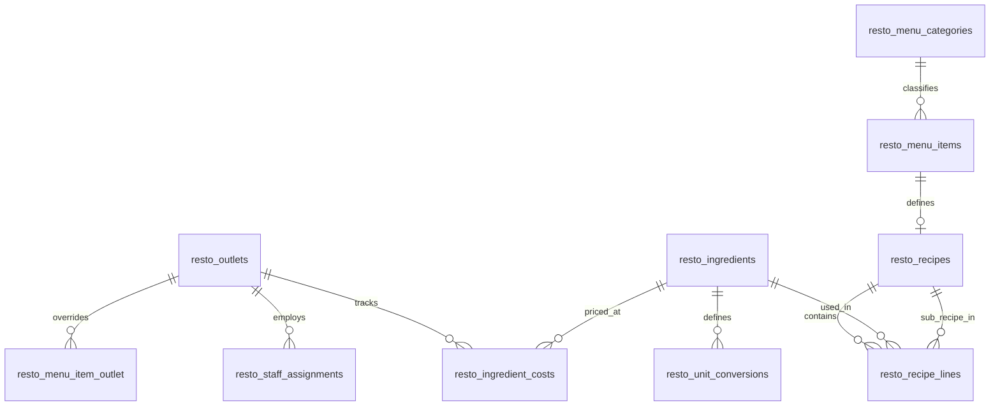

# Arsitektur Sistem AutoServe

AutoServe adalah platform otomotif terpadu (*superwebsite*) berskala enterprise yang dirancang dengan pola **Modular Monolith** di atas framework Laravel 11. Arsitektur ini menggabungkan fleksibilitas pengembangan monolit dengan isolasi batas domain yang tegas antar-modul bisnis.

---

## 1. Prinsip Desain & Pola Arsitektur

### 1.1 Modular Monolith
Setiap kapabilitas bisnis dikelompokkan ke dalam modul independen di bawah direktori `modules/{ModulName}`. Modul memiliki siklus hidup, migration, domain model, logic aplikasi, UI view, dan test tersendiri.

```
modules/{Modul}/
├── Application/               # Use cases, Action classes, Domain services, Event listeners
├── Contracts/                 # Interface publik untuk konsumsi lintas modul
├── Console/                   # Artisan commands terjadwal / operasional
├── Domain/
│   ├── Enums/                 # PHP 8.3 Backed Enums untuk state & tipe
│   ├── Events/                # Domain events untuk integrasi asinkron / loose-coupling
│   └── Models/                # Eloquent models dengan business rules terenkapsulasi
├── Http/Controllers/          # HTTP request handlers & view presenters
├── database/
│   ├── migrations/            # Migrasi database dengan prefix tabel per modul
│   └── seeders/               # Data awal modul
├── resources/views/           # Blade templates (namespaced: {modul}::...)
├── routes/web.php             # Deklarasi rute HTTP web & API internal
├── tests/Feature/             # Pest / PHPUnit test spesifik modul
└── {Modul}ServiceProvider.php # Registrasi service, contract binding, view namespace
```

### 1.2 Batasan Modul & Aturan Dependensi (Module Boundaries)
Untuk mencegah *tight coupling* ("spaghetti monolith"):
1. **Tidak Ada Akses DB Facade Langsung di Controller**: Controller hanya mendelegasikan request ke Action/Service atau memanggil Query Builder via Model Eloquent.
2. **Domain Layer Bebas dari HTTP**: Layer Domain dan Application tidak boleh mengimpor kelas dari namespace `Illuminate\Http` atau controller.
3. **Isolasi Domain Antar-Modul**:
   - Modul `AutoServe` tidak boleh mengimpor namespace Domain dari `AutoDex`, dan sebaliknya.
   - Komunikasi antar-modul **wajib** melalui:
     - **Contracts / Interfaces** (contoh: `AcquiresVehicle`, `TransfersVehicleOwnership`).
     - **Domain Events** (contoh: `PricesTicked` didengar oleh `MonitorLoanRisk`).
     - **Payment / Ledger Services** yang terdaftar di container.
4. **Verifikasi Arsitektur Otomatis**: Ditegakkan melalui *Arch Tests* di `tests/Architecture/ModuleBoundariesTest.php`.

---

## 2. Peta Modul

| Modul | Prefix Tabel | Tanggung Jawab Utama |
|---|---|---|
| **Core** | `core_` | Registri kendaraan terpadu, paspor digital hash-chain, notifikasi sistem, activity feed, dashboard terintegrasi. |
| **Banking** | `bank_` | Double-entry ledger multi-aset, akun internal/eksternal, dompet digital IDR & Kripto, transfer P2P, PIN keamanan. |
| **Payment** | `pay_` | Payment Hub sentral, orchestrator *charge*, *hold*, *capture*, *release*, dan *refund* berbasis kontrak `Payable`. |
| **Inventory** | `inv_` | Pelacak mutasi stok terpusat (`StockMovement`), reservasi stok atomik saat checkout/servis. |
| **Store** | `store_` | Katalog produk sparepart/aksesoris, checkout keranjang belanja, bursa jual-beli mobil bekas C2C dengan escrow. |
| **AutoServe** | `serve_` | Manajemen operasional bengkel: pendaftaran servis, estimasi biaya, alokasi mekanik, invoice & backorder part. |
| **AutoDex** | `dex_` | Ensiklopedia otomotif global, garasi virtual (*My Garage*), dan wishlist kendaraan. |
| **Crypto** | `crypto_` | Simulasi bursa kripto (BTC, ETH, SOL), engine kuotasi harga dengan time-lock 15 detik, trading fee, dan price alerts. |
| **Finance** | `fin_` | Program *HODL-to-Drive* (pembiayaan kendaraan beragun kripto), jadwal cicilan flat, scheduler denda, LTV risk monitor & likuidasi. |
| **Resto** | `resto_` | Jaringan resto Padang "RM Sari Ranah": multi-outlet, dapur sentral, menu, resep berlapis BOM, kalkulasi HPP, batch dapur, etalase hidang, POS shift, rantai pasok. |
| **Mall** | `mall_` | Pengelolaan "Duta Mall": leasing unit, tagihan sewa & utilitas, revenue sharing tenant, parkir terintegrasi, poin loyalty PTS, voucher mall, fasilitas. |
| **Shared** | - | Value objects (`Money`), base classes, komponen Blade seragam, Menu Registry global. |

---

## 3. Sistem Inti & Invarian Data

### 3.1 Double-Entry Ledger (Banking Module)
Seluruh pergerakan nilai moneter dan aset digital dicatat secara berpasangan dalam buku besar akuntansi:
- **Aturan Fundamental**: Setiap transaksi terdiri atas minimal 2 entri jurnal dengan mata uang/aset yang sama. Jumlah total debit dan kredit pada setiap transaksi harus tepat seimbang:
  $$\sum \text{amount} = 0$$
- **Multi-Asset Uniformity**: Mendukung IDR (fiat) dan koin kripto (BTC, ETH, SOL, BNB, USDT) menggunakan presisi `decimal(36,18)`.
- **Lock Ordering Anti-Deadlock**: `LedgerService` mengurutkan ID akun yang terlibat secara ascending (`orderBy('id', 'asc')->lockForUpdate()`) sebelum mengunci baris di database.
- **Audit Rutin**: Perintah `php artisan bank:reconcile` memvalidasi bahwa `SUM(entries) == 0` global untuk semua aset dan saldo cache setiap akun sama persis dengan agregat historis entri jurnal.

### 3.2 Vehicle Passport Hash-Chain (Core Module)
Setiap kendaraan (`core_vehicles`) memiliki paspor riwayat digital yang anti-pemalsuan:
- **Algoritma**: SHA-256 Hash Chain berantai:
  $$H_i = \text{SHA256}(H_{i-1} \,\|\, \text{event\_type} \,\|\, \text{payload\_json} \,\|\, \text{created\_at})$$
  Blok pertama (*Genesis Block*) memiliki `previous_hash = 0000000000000000000000000000000000000000000000000000000000000000`.
- **Append-Only & Immutability**: Model Eloquent `VehicleEvent` membatasi operasi `update` dan `delete` via exception.
- **Integritas Publik**: Paspor dapat dibagikan secara publik menggunakan Laravel Signed URLs yang kedaluwarsa.
- **Audit Otomatis**: Perintah `php artisan core:verify-passports` memindai seluruh blok rantai dan memverifikasi keutuhan hash.

### 3.3 Centralized Payment Hub (Payment Module)
Modul Payment bertindak sebagai gerbang pembayaran modular yang mengisolasi urusan kasir dari modul bisnis:
- **Model Interface `Payable`**: Setiap entitas yang dapat ditagih (Order Toko, Invoice Bengkel, Order C2C) mengimplementasikan `Payable`:
  - `payableAmount()`: Jumlah tagihan bersih.
  - `revenueSplits()`: Pemetaan pembagian dana ke akun pendapatan/seller.
- **Siklus Hidup Pembayaran (Two-Phase)**:
  - *Direct Charge*: Pengurangan saldo seketika untuk pembelian langsung.
  - *Two-Phase (Hold & Capture)*:
    1. `hold()`: Menahan dana pembeli ke akun escrow sistem (`escrow:payment:IDR`).
    2. `capture()`: Menyalurkan dana ke penerima dan mengembalikan kelebihan dana (*remainder*) ke pembeli secara otomatis jika biaya akhir lebih kecil dari estimasi.
    3. `release()`: Membatalkan hold dan mengembalikan seluruh dana ke pembeli jika transaksi dibatalkan atau kedaluwarsa.

### 3.4 Inventory Movements & Atomisitas Stok (Inventory Module)
- **Zero Phantom Stock**: Stok produk dihitung melalui rekonsiliasi tabel append-only `inv_stock_movements`.
- **Reservasi Dua Langkah**:
  1. Saat checkout keranjang atau konfirmasi estimasi bengkel, stok direservasi (`RESERVATION`, pergerakan kuantitas negatif pada stok tersedia).
  2. Saat pembayaran sukses, alasan mutasi diubah menjadi penjualan pasti (`SALE`).
  3. Jika checkout gagal atau pesanan kedaluwarsa, mutasi pembatalan dicatat (`RESERVATION_RELEASE`).

### 3.5 Pembiayaan Kripto HODL-to-Drive (Finance Module)
- **Kolateral Kripto**: Peminjam mengunci aset kripto di dompet kolateral sistem (`escrow:finance:collateral:{ASSET}`).
- **Pencairan & Piutang**: Sistem mencairkan dana melalui akun piutang bersaldo negatif (`loan_receivable:IDR`), yang mencerminkan outstanding pokok pinjaman.
- **Risk Engine Berbasis Event**: Setiap kali harga kripto berfluktuasi (`PricesTicked`), risk engine mengevaluasi rasio LTV (*Loan-to-Value*):
  $$\text{LTV} = \frac{\text{Sisa Pokok}}{\text{Nilai Pasar Kolateral}} \times 100\%$$
  - $\text{LTV} \ge 80\%$: Memicu status `margin_call` dan mengirim peringatan ke pengguna.
  - $\text{LTV} \ge 90\%$: Memicu likuidasi otomatis; kolateral dijual, sisa pokok ditutup, dan sisa dana dikembalikan ke pengguna.

---

## 4. Keamanan & Proteksi Transaksi

1. **Proteksi PIN Transaksi**: Aksi berisiko tinggi (transfer saldo, konfirmasi checkout, eksekusi trading, pengajuan pinjaman) dilindungi verifikasi PIN 6-digit dengan mekanisme penguncian otomatis (maksimal 5 kesalahan berturut-turut memicu penguncian akun selama 15 menit).
2. **Role-Based Access Control (RBAC)**: Pemisahan peran menggunakan field `role` (`admin`, `mechanic`, `customer`) dan route middleware dedicated (`auth`, `role:admin`, `role:mechanic`).
3. **Pessimistic Concurrency**: Penggunaan `lockForUpdate()` pada record kunci (stok barang, saldo dompet, baris kendaraan C2C) untuk menangkal bahaya *race condition* dan *double-spending*.

---

## 5. Layanan Platform & Dashboard Terpadu (Fase 6)

- **Notification Service**: Penyimpanan notifikasi in-app pada database lokal dengan badge unread counter real-time dan modal dropdown di header navigasi.
- **Activity Logger**: Pencatatan riwayat aktivitas pengguna (servis, belanja, transfer, trading, cicilan) lintas modul dengan antarmuka feed terpadu.
- **Role-Tailored Dashboards**:
  - `Customer Dashboard`: Ringkasan saldo dompet, portofolio kripto, kendaraan di garasi, servis aktif, pinjaman berjalan, dan pesanan terbaru.
  - `Admin Dashboard`: Statistik pendapatan harian, total omzet bengkel & toko, metrik LTV portofolio pinjaman, antrean pesanan pending, dan peringatan sistem.
  - `Mechanic Dashboard`: Daftar antrean kendaraan bengkel, status servis aktif yang ditugaskan, pencatatan sparepart terpakai, dan riwayat pekerjaan selesai.

---

## 6. Modul Resto (RM Sari Ranah)

### 6.1 ERD Fondasi Menu, Bahan & Resep


### 6.2 Resep Berlapis (BOM) & Kalkulasi HPP Rekursif
- **Bumbu Dasar Sebagai Sub-Resep**: Bumbu dasar (misal Bumbu Dasar Merah Padang, Bumbu Gulai Minang) didefinisikan sebagai `Recipe` dengan `sub_recipe_name` tanpa `menu_item_id`.
- **Kalkulasi Rekursif**: `RecipeCostCalculator` menelusuri setiap baris resep. Jika baris merujuk ke sub-resep, biaya dihitung secara rekursif berdasarkan rasio yield, moving average cost bahan di outlet terkait, dan persentase waste (`waste_percent`).
- **Pencegahan Resep Sirkular**: Menggunakan penelusuran `$visitedRecipeIds`. Jika ditemukan dependensi siklis (A $\to$ B $\to$ A), sistem melempar `RecipeCycleDetected` exception.
- **Peringatan Batas Margin**:
  - `HPP > Harga Jual`: Peringatan bahaya (Rugi per porsi).
  - `Margin < 30%`: Peringatan margin rendah karena risiko biaya operasional dan waste etalase.

### 6.3 Akun Sistem Ledger Resto
| Kode Akun | Jenis (`kind`) | Sifat Saldo | Keterangan |
|---|---|---|---|
| `cash:drawer:{outlet}:IDR` | `cash` | Debet (+) | Uang fisik di laci kasir per outlet |
| `revenue:resto:{outlet}:food:IDR` | `revenue` | Kredit (+) | Omzet penjualan makanan Padang |
| `revenue:resto:{outlet}:beverage:IDR` | `revenue` | Kredit (+) | Omzet penjualan minuman |
| `revenue:resto:{outlet}:catering:IDR` | `revenue` | Kredit (+) | Omzet pesanan katering & nasi kotak |
| `inventory:resto:{outlet}:IDR` | `inventory` | Debet (+) | Nilai persediaan bahan & barang jadi |
| `expense:resto:cogs:IDR` | `expense` | Debet (+) | Harga Pokok Penjualan saat porsi terjual |
| `expense:resto:waste:IDR` | `expense` | Debet (+) | Beban makanan etalase kedaluwarsa / rusak |
| `expense:resto:cash_variance:IDR` | `expense` | Allow Negative | Selisih lebih/kurang kas saat tutup shift |
| `ap:supplier:{id}:IDR` | `ap` | Allow Negative | Utang dagang ke supplier bahan baku |
| `revenue:group:royalty:IDR` | `revenue` | Kredit (+) | Pendapatan royalti franchise grup |

### 6.4 Dapur, Batch Produksi & Siklus Etalase Hidang (Fase 8)
- **Pelacakan Stok Bahan & InventoryService**: Modul `Inventory` diperluas dengan metode decimal presisi `availableIngredient`, `deductIngredient`, `addIngredient`, dan `adjustIngredient`. Pergerakan dicatat di tabel `resto_ingredient_movements` dan saldo per outlet disimpan di `resto_ingredient_stocks`.
- **Alur Batch Produksi (`CookBatchAction`)**:
  1. Penelusuran resep rekursif untuk menghitung kebutuhan total bahan baku dasar (memperhitungkan `waste_percent`).
  2. Pengecekan ketersediaan stok tiap bahan. Jika ada kekurangan, sistem melempar `ShortageException` disertai daftar bahan yang kurang dan kalkulasi porsi maksimum yang dapat dimasak (`suggestedMaxPortions`).
  3. Pemotongan stok bahan baku melalui `InventoryService` dengan alasan `production`.
  4. Pencatatan pemakaian riil di `resto_batch_consumptions`.
  5. Posting double-entry ledger: internal transfer nilai dari bahan mentah ke barang jadi pada akun `inventory:resto:{outlet}:IDR` (debit senilai biaya batch, kredit senilai biaya batch). Saldo total persediaan outlet tetap seimbang dan global IDR sum = 0.
  6. Penempatan piring ke etalase hidang (`resto_display_trays`) dengan batas kedaluwarsa 6 jam.
- **Siklus Etalase Hidang Padang (`DisplayTray`)**:
  - `MAX_RECIRCULATION = 3`: Piring hidang yang dibawa ke meja dan **tidak disentuh** boleh kembali ke etalase maksimal 3 kali.
  - `MAX_DISPLAY_HOURS = 6`: Piring di etalase yang telah melewati batas 6 jam sejak dimasak tidak boleh dihidangkan lagi.
  - Piring yang disentuh sebagian dihitung **terjual penuh** (aturan rumah makan Padang) dan tidak boleh kembali ke etalase.
  - Resirkulasi ke-4 atau piring melewati batas waktu otomatis dialihkan ke status `discarded`.
- **Manajemen Limbah (Waste)**:
  - Command terjadwal `resto:expire-display` (tiap 15 menit) memindai piring kedaluwarsa.
  - Pembuangan piring mencatat kerugian HPP porsi tersisa ke ledger: Debet `expense:resto:waste:IDR`, Kredit `inventory:resto:{outlet}:IDR`.

### 6.5 POS Hidang, Sesi Meja, Shift Kasir & Tutup Harian (Fase 9)
- **Siklus Sesi Meja & Hidang**:
  - `resto_tables`: kode meja, jumlah kursi, zona (`indoor`, `outdoor`, `lesehan`, `vip`), status (`available`, `occupied`, `reserved`, `cleaning`).
  - `resto_table_sessions`: sesi tamu aktif per meja (`open`, `closing`, `closed`, `abandoned`).
  - `resto_order_items`: item yang disajikan memiliki snapshot harga & status konsumsi (`presented`, `consumed`, `returned`).
  - Piring hidang yang disajikan (`source = hidang`) berstatus `presented` dan belum menambah subtotal sampai diverifikasi pada layar *Hitung Hidangan*.
  - Item yang disentuh (`consumed`) dihitung harga penuh (aturan hidang Minang), memotong porsi tray, dan memposting HPP ke `expense:resto:cogs:IDR` vs `inventory:resto:{outlet}:IDR`.
  - Item utuh (`returned`) dikembalikan ke etalase via `RecirculateTrayAction` dengan resirkulasi +1.
  - PB1 10% dihitung dari subtotal setelah diskon; pembulatan dilakukan ke kelipatan Rp 100 terdekat dengan selisih pembulatan dicatat di field `rounding`.
- **Manajemen Kas & Shift Kasir**:
  - Kasir wajib memiliki shift berstatus `open` sebelum dapat memproses transaksi tunai. Satu kasir hanya boleh memiliki 1 shift aktif pada satu waktu.
  - Saat tutup shift (`CloseShiftAction`), kasir menginput hitungan fisik kas (`counted_cash`). Sistem membandingkan dengan `expected_cash = opening_float + cash_sales`.
  - Selisih kas (`variance = counted - expected`) diposting ke ledger: `expense:resto:cash_variance:IDR` vs `cash:drawer:{outlet}:IDR`.
  - Setoran uang tunai dari laci kasir ke rekening bank dicatat melalui `SettleCashAction` (`cash:drawer` $\to$ `clearing:external:IDR`).
- **Otorisasi Pembatalan (VOID)**:
  - Pembatalan pesanan (VOID) hanya dapat dilakukan oleh role `admin` atau `outlet_manager` dengan alasan wajib.
  - Jika pesanan sudah dibayar tunai, pembukuan dibalik melalui posting ledger `TransactionType::REFUND`. Jika dibayar via dompet digital (wallet), pengembalian dana diproses melalui `PaymentGateway::refund`.
- **Penutupan Harian (`resto:close-day`) & Audit Ledger**:
  - Berjalan otomatis tiap 23:59 atau secara manual.
  - Membuang sisa piring etalase ke waste, menutup shift kasir yang lupa ditutup, dan mengagregasi data ke tabel `resto_daily_summaries`.
  - Flag `--check` memvalidasi angka ringkasan harian terhadap akumulasi transaksi riil di buku besar (ledger) outlet tersebut.
  - Seluruh laporan & dashboard membaca tabel ringkasan `resto_daily_summaries` untuk menjaga efisiensi query.


