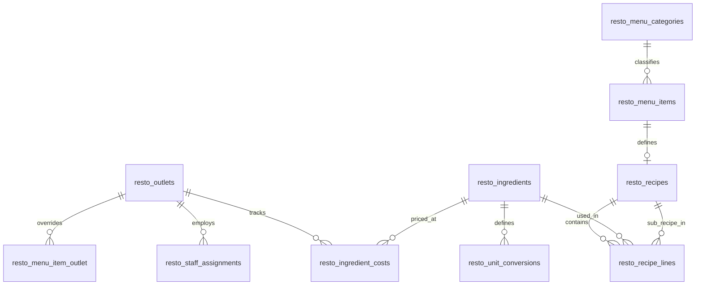
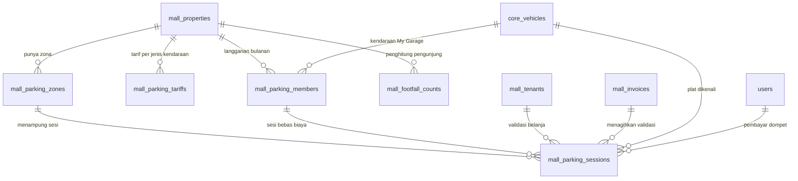
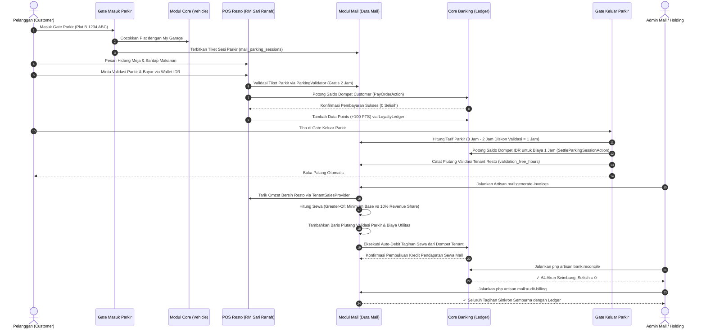

# Arsitektur Sistem AutoServe

AutoServe adalah platform otomotif terpadu (*superwebsite*) berskala enterprise yang dirancang dengan pola **Modular Monolith** di atas framework Laravel 13 (PHP ^8.4). Arsitektur ini menggabungkan fleksibilitas pengembangan monolit dengan isolasi batas domain yang tegas antar-modul bisnis.

---

## 1. Prinsip Desain & Pola Arsitektur

### 1.1 Modular Monolith
Setiap kapabilitas bisnis dikelompokkan ke dalam modul independen di bawah direktori `modules/{ModulName}`. Modul memiliki siklus hidup, migration, domain model, logic aplikasi, UI view, dan test tersendiri.

```
modules/{Modul}/
├── Application/               # Use cases, Action classes, Domain services, Event listeners
├── Contracts/                 # Interface publik untuk konsumsi lintas modul
├── Console/                   # Artisan commands terjadwal / operasional
├── Domain/
│   ├── Enums/                 # PHP 8.4 Backed Enums untuk state & tipe
│   ├── Events/                # Domain events untuk integrasi asinkron / loose-coupling
│   └── Models/                # Eloquent models dengan business rules terenkapsulasi
├── Http/Controllers/          # HTTP request handlers & view presenters
├── database/
│   ├── migrations/            # Migrasi database dengan prefix tabel per modul
│   └── seeders/               # Data awal modul
├── resources/views/           # Blade templates (namespaced: {modul}::...)
├── routes/web.php             # Deklarasi rute HTTP web & API internal
├── tests/Feature/             # Pest / PHPUnit test spesifik modul
└── {Modul}ServiceProvider.php # Registrasi service, contract binding, view namespace
```

### 1.2 Batasan Modul & Aturan Dependensi (Module Boundaries)
Untuk mencegah *tight coupling* ("spaghetti monolith"):
1. **Tidak Ada Akses DB Facade Langsung di Controller**: Controller hanya mendelegasikan request ke Action/Service atau memanggil Query Builder via Model Eloquent.
2. **Domain Layer Bebas dari HTTP**: Layer Domain dan Application tidak boleh mengimpor kelas dari namespace `Illuminate\Http` atau controller.
3. **Isolasi Domain Antar-Modul**:
   - Modul `AutoServe` tidak boleh mengimpor namespace Domain dari `AutoDex`, dan sebaliknya.
   - Komunikasi antar-modul **wajib** melalui:
     - **Contracts / Interfaces** (contoh: `AcquiresVehicle`, `TransfersVehicleOwnership`).
     - **Domain Events** (contoh: `PricesTicked` didengar oleh `MonitorLoanRisk`).
     - **Payment / Ledger Services** yang terdaftar di container.
4. **Verifikasi Arsitektur Otomatis**: aturan di atas diperiksa `php artisan arch:scan` (aturan A1 import Domain lintas modul, A2 tabel berprefiks modul lain, A9 kernel bergantung pada modul bisnis; lihat §1.3) dan `tests/Architecture/ModuleBoundariesTest.php`. Pelanggaran yang sudah ada per 10 Okt 2026 tercatat sebagai baseline yang hanya boleh turun (`KNOWLEDGE.md` K-04/K-05). Artinya aturan ini **belum** dipatuhi seluruh kode lama, tetapi kode baru yang melanggar langsung menggagalkan gate.

### 1.3 Pagar Otomatis & Quality Gate (`app/Quality`)

Sejak Fase R0, aturan proses di `PROGRESS.md` (P1–P13) dan aturan desain di `KONSEP.md` §A14 ditegakkan oleh kode, bukan hanya oleh dokumen. Komponennya berada di `app/Quality/` (tooling lintas modul, tanpa tabel) dan diuji di `tests/Architecture/`.

**Pola ratchet.** Pelanggaran lama dicatat di `tests/Architecture/baselines/*.json`:
- `arch:scan` dan TestHygiene memakai sidik jari per aturan → file → tanda tangan pelanggaran.
- Detektor lain memakai himpunan entri.

Test gagal bila ada entri **baru** (perbaiki kodenya) atau entri yang **sudah hilang** (turunkan baseline di commit yang sama). Entri baru hanya bisa masuk lewat `approved_additions` yang menunjuk anchor `docs/DECISIONS.md` yang benar-benar ada (diperiksa `app/Quality/Docs/DecisionLog`). Cara memperbarui baseline: `RUNBOOK.md` §6.1.

| Pagar | Menolak | Komponen | Dijalankan oleh |
|---|---|---|---|
| `arch:scan` (A1–A13) | import Domain/tabel lintas modul, float uang, idempotency key acak, type transaksi liar, parameter bool kontrol, hash tanpa kunci, `setTestNow` di produksi, kernel → modul bisnis, `$guarded = []`, tanpa `strict_types`, `*_id` tanpa FK, `back()->errors()` | `ArchScan/` (tokenizer PHP bawaan), `Modules/ModuleRegistry` + `config/modules.php` (registry prefiks tabel) | `ArchScanBaselineTest`, `php artisan arch:scan` |
| Integritas PROGRESS | centang tanpa Bukti valid, commit yang tidak menyentuh file bukti, rute tanpa role, ✅ tanpa Verifikasi, minus P0/P1 terbuka saat ✅, teks item diubah tanpa ⬇️ | `Progress/` (parser, `GitCommitInspector`), snapshot `progress-snapshot-8c8369d.json` | `ProgressIntegrityTest` |
| Matriks otorisasi rute | rute tanpa entri di `tests/Architecture/route-roles.php`, proteksi rute melemah, role tak berhak tidak 403 | `Routing/RouteAuthorizationScanner` | `RouteAuthorizationMatrixTest` |
| Kontrak audit | `*:audit`/`*:reconcile`/`verify-*` tanpa fixture korupsi (bersih → exit 0, rusak → exit ≠ 0) | `Audit/` (`AuditCommandRegistry`, `Fixtures/`) | `AuditCommandContractTest` |
| Ledger | kode akun produksi tanpa provisi seeder; saldo berlawanan sisi normal | `Ledger/` | `LedgerAccountRegistryTest`, `LedgerNormalBalanceTest` |
| Pembekuan Integration | file/tabel baru di `modules/Integration` di luar allowlist adapter | `Freeze/IntegrationFreeze` | `IntegrationFreezeTest` |
| Higiene test (T1–T4) | assertion yang tidak bisa gagal, `LedgerAccount::create` di test, skip tanpa rujukan BLOCKERS, modul tanpa test HTTP | `TestHygiene/` | `TestHygieneTest` |
| Portabilitas | path kelas ≠ namespace (case-sensitive); identifier > 64; DDL yang ditolak MySQL 8.4 | `Autoload/Psr4ComplianceChecker`, `Database/MysqlDdlReplay` + `MysqlSchemaChecker` | `Psr4ComplianceTest`, `SchemaIdentifierLengthTest`, `MysqlSchemaCompatibilityTest`, job CI MySQL |
| Nama command unik | dua kelas mendaftarkan signature yang sama (kasus `api:audit`) | `Commands/CommandNameCollector` | `CommandSignatureUniqueTest` |
| Kejujuran dokumen | versi Laravel/PHP yang diklaim ≠ `composer.lock`, akun fiktif di CODEBASE | — | `DocsVersionConsistencyTest` |
| Kontrak CI & repo | job CI dihapus/dilemahkan, CODEOWNERS hilang, template PR tanpa V1–V12/C1–C14 | — | `CiWorkflowContractTest`, `CodeownersContractTest`, `GateTemplateContractTest`, `GateCommandContractTest`, `MutationTestingContractTest` |

**Quality gate.**
- `composer gate` → `php artisan gate:run` (`Gate/GateRunner`) menjalankan sembilan langkah P4 dan menulis manifest (commit, status dirty, exit code dan durasi tiap langkah). `migrate:fresh --seed` dan audit memakai database SQLite khusus gate.
- `php artisan gate:report --fase=N` (`Gate/GateReportGenerator`, `JUnitParser`) menulis `docs/gates/fase-N.md` hanya dari manifest dan JUnit asli. Laporan ditolak bila gate gagal, ada langkah hilang, commit ≠ HEAD, tree kotor, JUnit tidak hijau, atau test Bukti tidak lulus.
- `php artisan test:mutate` (`Mutation/MutationTargetResolver`) menjalankan mutation testing Pest pada kelas Action/Service yang diubah, dengan ambang 60%.
- Ketiganya dijalankan CI (`.github/workflows/ci.yml`): job SQLite (gate penuh), job MySQL 8.4 (migrasi, seeder, `@group db-portability`), dan job mutation (pull request).

File baseline, `route-roles.php`, workflow CI, `PROGRESS.md`, `DECISIONS.md`, `docs/gates/`, dan `app/Quality/` dimiliki pemilik lewat `.github/CODEOWNERS`.

---

## 2. Peta Modul

| Modul | Prefix Tabel | Tanggung Jawab Utama |
|---|---|---|
| **Core** | `core_` | Registri kendaraan terpadu, paspor digital hash-chain, notifikasi sistem, activity feed, dashboard terintegrasi. |
| **Banking** | `bank_` | Double-entry ledger multi-aset, akun internal/eksternal, dompet digital IDR & Kripto, transfer P2P, PIN keamanan. |
| **Payment** | `pay_` | Payment Hub sentral, orchestrator *charge*, *hold*, *capture*, *release*, dan *refund* berbasis kontrak `Payable`. |
| **Inventory** | `inv_` | Pelacak mutasi stok terpusat (`StockMovement`), reservasi stok atomik saat checkout/servis. |
| **Store** | `store_` | Katalog produk sparepart/aksesoris, checkout keranjang belanja, bursa jual-beli mobil bekas C2C dengan escrow. |
| **AutoServe** | `serve_` | Manajemen operasional bengkel: pendaftaran servis, estimasi biaya, alokasi mekanik, invoice & backorder part. |
| **AutoDex** | `dex_` | Ensiklopedia otomotif global, garasi virtual (*My Garage*), dan wishlist kendaraan. |
| **Crypto** | `crypto_` | Simulasi bursa kripto (BTC, ETH, SOL), engine kuotasi harga dengan time-lock 15 detik, trading fee, dan price alerts. |
| **Finance** | `fin_` | Program *HODL-to-Drive* (pembiayaan kendaraan beragun kripto), jadwal cicilan flat, scheduler denda, LTV risk monitor & likuidasi. |
| **Resto** | `resto_` | Jaringan resto Padang "RM Sari Ranah": multi-outlet, dapur sentral, menu, resep berlapis BOM, kalkulasi HPP, batch dapur, etalase hidang, POS shift, rantai pasok. |
| **Mall** | `mall_` | Pengelolaan "Duta Mall": leasing unit, tagihan sewa & utilitas, revenue sharing tenant, parkir terintegrasi, poin loyalty PTS, voucher mall, fasilitas. |
| **Shared** | - | Value objects (`Money`), base classes, komponen Blade seragam, Menu Registry global. |
| **Logistics** | `lgx_` | Sari Ranah Express: multi-modal routing, fleet & driver dispatch, hub scanning, LCL consolidation, customs clearance, live tracking. |
| **Party** | `pty_` | Registri pihak tunggal (perorangan / badan usaha), relasi entitas legal, KYC, verifikasi sanksi, profil kredit. |
| **Asset** | `ast_` | Register aset tetap grup (PSAK 16/73), depresiasi komersial/fiskal, revaluasi, work order pemeliharaan, asuransi, leasing. |
| **Supplier** | `sup_` | Master data pemasok/produsen, sertifikasi halal/ISO, matriks tiering harga, audit kualifikasi, supplier scorecard & risk scanning. |
| **Contract** | `ctr_` | Manajemen siklus kontrak korporat, templat klausul, approval berjenjang, e-sign simulasi, hash-chain append-only, jadwal termin. |
| **Procurement** | `prc_` | Siklus PR → RFQ → Tender → PO, budget encumbrance, receiving report GRN, 3-way match, landed cost allocation. |
| **Manufacturing** | `mfg_` | Master pabrik, BOM multi-level, routing, formula hash-chain, perencanaan MRP/MPS, shop floor tracking, costing WIP, QMS, OEE & HSE. |
| **WMS** | `wms_` | Gudang multi-zona, rak & bin, bin stock, task picking & putaway ber-wave, cross-docking, cycle count four-eyes, packing list. |
| **Distribution** | `dist_` | Jaringan distribusi/agen, teritori eksklusif, limit kredit AR, ATP reservation, faktur pajak seri resmi, konsinyasi, program rebate. |
| **Pricing** | `pric_` | Engine harga deterministik, waterfall diskon, price list wilayah/segmen, margin floor policy, immutable price lock. |
| **Agency** | `agy_` | Tata kelola agen penjualan, skema komisi multi-tier ber-override upline, hold masa retur, clawback, payout ber-PPh 21/23. |
| **Partner** | `ptn_` | Ekosistem kemitraan strategis, due diligence, Joint Business Plan (JBP), revenue share multi-party, direktori co-selling. |
| **Treasury** | `trs_` | Perbendaharaan multi-valas, kurs versi immutable scaled 1e6, revaluasi kurs periodik, cash pool sweeping, cash forecast 13 minggu. |
| **Trade** | `trd_` | Tata niaga lintas batas, kepatuhan Incoterms 2020, HS Code landed cost, kepabeanan PEB/PIB, pelacakan kargo perbatasan. |
| **Trade Finance** | `tf_` | Instrumen SCF internasional, Letter of Credit UCP 600, diskrepansi dokumen ekspor-impor, penagihan D/P-D/A, bank garansi tender. |
| **International** | `intl_` | Aliansi global PMA, joint venture equity/contractual, lisensi teknologi internasional & MAG royalti, tax treaty P3B. |
| **Intercompany** | `ic_` | Konsolidasi grup multi-entitas, transaksi cermin SO-PO/AR-AP, transfer pricing wajar (CUP/CPM/RPM/TNMM), eliminasi saldo resiprokal. |
| **Control Tower** | `sct_` | Menara kendali rantai pasok multi-eselon ABC/XYZ, demand forecasting S&OP, alokasi janji ATP/CTP, radar peringatan gangguan rantai pasok. |
| **Enterprise Finance** | `ef_` | Kontrol pagu anggaran unit bisnis (hard-stop/soft-stop), kalender kepatuhan pajak grup, matriks pemisahan tugas (SoD) anti-fraud. |
| **Integration** | `intg_` | B2B REST API v2 & EDI gateway (EDIFACT / ANSI X12), webhook publisher HMAC-SHA256, tiered rate limiting. |
| **HCM** | `hcm_` | Human Capital Management, master pegawai PKWT/PKWTT, payroll engine otomatis PPh 21 TER & BPJS, alokasi jam kerja ke SPK pabrik. |
| **PLM** | `plm_` | Product Lifecycle Management, pipeline riset Stage-Gate, konversi EBOM ke MBOM resep pabrik, ECO berantai hash SHA-256, ELN lab. |
| **ESG** | `esg_` | Pengukuran emisi GRK GHG Protocol Scope 1-3, bursa karbon IDX Carbon / Verra, offset retirement net-zero, ESG supplier scorecard GRI. |
| **B2B** | `b2b_` | Marketplace grosir tertutup, alur negosiasi RFQ komersial, balai lelang digital aset surplus & mesin pabrik anti-sniping, escrow akun. |
| **EPC** | `epc_` | Rekayasa konstruksi proyek properti & pabrik, hierarki WBS bobot 100%, kurva-S, Monthly Certificate MC retensi 5%, kapitalisasi CIP ke Aset. |
| **Hospital** | `hosp_` | Layanan kesehatan & farmasi, EMR paspor pasien hash-chain, ketersediaan bed rawat inap & ICU, contraindication engine, BPJS/asuransi billing. |
| **Venue** | `ven_` | Entertainment & beach club, ticketing non-fungible hash-chain, access control RFID/QR gate, zone crowd safety, VIP table escrow, festival bundle. |
| **Hotel** | `htl_` | Hospitality PMS, alokasi kamar anti-oversell, dynamic rate protection, smart lock keyless QR, HVAC energy twin setback, timeshare yield. |
| **Mining** | `min_` | Pertambangan & alat berat, mine planning, fleet dispatch, weighbridge digital hash-chain, akrual royalti PNBP, HSE work permit. |
| **Energy** | `egy_` | Pembangkit EBT/Fosil, transmisi SCADA, automated grid dispatch, microgrid islanding, SPKLU smart metering, sertifikat REC hash-chain. |
| **Telecom** | `tlx_` | Jaringan ISP & fiber optic, NOC monitoring, tower sharing, data center rack leasing & PUE cooling twin, RADIUS bandwidth throttling. |
| **Media** | `med_` | Stage-gate produksi film/musik, DRM watermark tamper-evident, distribusi SVOD/broadcast, royalti kreator, sponsorship escrow. |
| **Education** | `edu_` | Student cohort class, grading engine, sertifikasi kompetensi digital hash-chain, akreditasi kurikulum, tuition split & scholarship fee. |
| **Retail** | `ret_` | Omnichannel OMS, inventory allocation, dark store picking wave, q-commerce ultra-fast dispatch, dynamic loyalty sync. |

---

## 3. Sistem Inti & Invarian Data

### 3.1 Double-Entry Ledger (Banking Module)
Seluruh pergerakan nilai moneter dan aset digital dicatat secara berpasangan dalam buku besar akuntansi:
- **Aturan Fundamental**: Setiap transaksi terdiri atas minimal 2 entri jurnal dengan mata uang/aset yang sama. Jumlah total debit dan kredit pada setiap transaksi harus tepat seimbang:
  $$\sum \text{amount} = 0$$
- **Multi-Asset Uniformity**: Mendukung IDR (fiat) dan koin kripto (BTC, ETH, SOL, BNB, USDT) menggunakan presisi `decimal(36,18)`.
- **Lock Ordering Anti-Deadlock**: `LedgerService` mengurutkan ID akun yang terlibat secara ascending (`orderBy('id', 'asc')->lockForUpdate()`) sebelum mengunci baris di database.
- **Audit Rutin**: Perintah `php artisan bank:reconcile` memvalidasi bahwa `SUM(entries) == 0` global untuk semua aset dan saldo cache setiap akun sama persis dengan agregat historis entri jurnal.

### 3.2 Vehicle Passport Hash-Chain (Core Module)
Setiap kendaraan (`core_vehicles`) memiliki paspor riwayat digital yang anti-pemalsuan:
- **Algoritma**: SHA-256 Hash Chain berantai:
  $$H_i = \text{SHA256}(H_{i-1} \,\|\, \text{event\_type} \,\|\, \text{payload\_json} \,\|\, \text{created\_at})$$
  Blok pertama (*Genesis Block*) memiliki `previous_hash = 0000000000000000000000000000000000000000000000000000000000000000`.
- **Append-Only & Immutability**: Model Eloquent `VehicleEvent` membatasi operasi `update` dan `delete` via exception.
- **Integritas Publik**: Paspor dapat dibagikan secara publik menggunakan Laravel Signed URLs yang kedaluwarsa.
- **Audit Otomatis**: Perintah `php artisan core:verify-passports` memindai seluruh blok rantai dan memverifikasi keutuhan hash.

### 3.3 Centralized Payment Hub (Payment Module)
Modul Payment bertindak sebagai gerbang pembayaran modular yang mengisolasi urusan kasir dari modul bisnis:
- **Model Interface `Payable`**: Setiap entitas yang dapat ditagih (Order Toko, Invoice Bengkel, Order C2C) mengimplementasikan `Payable`:
  - `payableAmount()`: Jumlah tagihan bersih.
  - `revenueSplits()`: Pemetaan pembagian dana ke akun pendapatan/seller.
- **Siklus Hidup Pembayaran (Two-Phase)**:
  - *Direct Charge*: Pengurangan saldo seketika untuk pembelian langsung.
  - *Two-Phase (Hold & Capture)*:
    1. `hold()`: Menahan dana pembeli ke akun escrow sistem (`escrow:payment:IDR`).
    2. `capture()`: Menyalurkan dana ke penerima dan mengembalikan kelebihan dana (*remainder*) ke pembeli secara otomatis jika biaya akhir lebih kecil dari estimasi.
    3. `release()`: Membatalkan hold dan mengembalikan seluruh dana ke pembeli jika transaksi dibatalkan atau kedaluwarsa.

### 3.4 Inventory Movements & Atomisitas Stok (Inventory Module)
- **Zero Phantom Stock**: Stok produk dihitung melalui rekonsiliasi tabel append-only `inv_stock_movements`.
- **Reservasi Dua Langkah**:
  1. Saat checkout keranjang atau konfirmasi estimasi bengkel, stok direservasi (`RESERVATION`, pergerakan kuantitas negatif pada stok tersedia).
  2. Saat pembayaran sukses, alasan mutasi diubah menjadi penjualan pasti (`SALE`).
  3. Jika checkout gagal atau pesanan kedaluwarsa, mutasi pembatalan dicatat (`RESERVATION_RELEASE`).

### 3.5 Pembiayaan Kripto HODL-to-Drive (Finance Module)
- **Kolateral Kripto**: Peminjam mengunci aset kripto di dompet kolateral sistem (`escrow:finance:collateral:{ASSET}`).
- **Pencairan & Piutang**: Sistem mencairkan dana melalui akun piutang bersaldo negatif (`loan_receivable:IDR`), yang mencerminkan outstanding pokok pinjaman.
- **Risk Engine Berbasis Event**: Setiap kali harga kripto berfluktuasi (`PricesTicked`), risk engine mengevaluasi rasio LTV (*Loan-to-Value*):
  $$\text{LTV} = \frac{\text{Sisa Pokok}}{\text{Nilai Pasar Kolateral}} \times 100\%$$
  - $\text{LTV} \ge 80\%$: Memicu status `margin_call` dan mengirim peringatan ke pengguna.
  - $\text{LTV} \ge 90\%$: Memicu likuidasi otomatis; kolateral dijual, sisa pokok ditutup, dan sisa dana dikembalikan ke pengguna.

---

## 4. Keamanan & Proteksi Transaksi

1. **Proteksi PIN Transaksi**: Aksi berisiko tinggi (transfer saldo, konfirmasi checkout, eksekusi trading, pengajuan pinjaman) dilindungi verifikasi PIN 6-digit dengan mekanisme penguncian otomatis (maksimal 5 kesalahan berturut-turut memicu penguncian akun selama 15 menit).
2. **Role-Based Access Control (RBAC)**: Pemisahan peran menggunakan field `role` (`admin`, `mechanic`, `customer`) dan route middleware dedicated (`auth`, `role:admin`, `role:mechanic`).
3. **Pessimistic Concurrency**: Penggunaan `lockForUpdate()` pada record kunci (stok barang, saldo dompet, baris kendaraan C2C) untuk menangkal bahaya *race condition* dan *double-spending*.

---

## 5. Layanan Platform & Dashboard Terpadu (Fase 6)

- **Notification Service**: Penyimpanan notifikasi in-app pada database lokal dengan badge unread counter real-time dan modal dropdown di header navigasi.
- **Activity Logger**: Pencatatan riwayat aktivitas pengguna (servis, belanja, transfer, trading, cicilan) lintas modul dengan antarmuka feed terpadu.
- **Role-Tailored Dashboards**:
  - `Customer Dashboard`: Ringkasan saldo dompet, portofolio kripto, kendaraan di garasi, servis aktif, pinjaman berjalan, dan pesanan terbaru.
  - `Admin Dashboard`: Statistik pendapatan harian, total omzet bengkel & toko, metrik LTV portofolio pinjaman, antrean pesanan pending, dan peringatan sistem.
  - `Mechanic Dashboard`: Daftar antrean kendaraan bengkel, status servis aktif yang ditugaskan, pencatatan sparepart terpakai, dan riwayat pekerjaan selesai.

---

## 6. Modul Resto (RM Sari Ranah)

### 6.1 ERD Fondasi Menu, Bahan & Resep


### 6.2 Resep Berlapis (BOM) & Kalkulasi HPP Rekursif
- **Bumbu Dasar Sebagai Sub-Resep**: Bumbu dasar (misal Bumbu Dasar Merah Padang, Bumbu Gulai Minang) didefinisikan sebagai `Recipe` dengan `sub_recipe_name` tanpa `menu_item_id`.
- **Kalkulasi Rekursif**: `RecipeCostCalculator` menelusuri setiap baris resep. Jika baris merujuk ke sub-resep, biaya dihitung secara rekursif berdasarkan rasio yield, moving average cost bahan di outlet terkait, dan persentase waste (`waste_percent`).
- **Pencegahan Resep Sirkular**: Menggunakan penelusuran `$visitedRecipeIds`. Jika ditemukan dependensi siklis (A $\to$ B $\to$ A), sistem melempar `RecipeCycleDetected` exception.
- **Peringatan Batas Margin**:
  - `HPP > Harga Jual`: Peringatan bahaya (Rugi per porsi).
  - `Margin < 30%`: Peringatan margin rendah karena risiko biaya operasional dan waste etalase.

### 6.3 Akun Sistem Ledger Resto
| Kode Akun | Jenis (`kind`) | Sifat Saldo | Keterangan |
|---|---|---|---|
| `cash:drawer:{outlet}:IDR` | `cash` | Debet (+) | Uang fisik di laci kasir per outlet |
| `revenue:resto:{outlet}:food:IDR` | `revenue` | Kredit (+) | Omzet penjualan makanan Padang |
| `revenue:resto:{outlet}:beverage:IDR` | `revenue` | Kredit (+) | Omzet penjualan minuman |
| `revenue:resto:{outlet}:catering:IDR` | `revenue` | Kredit (+) | Omzet pesanan katering & nasi kotak |
| `inventory:resto:{outlet}:IDR` | `inventory` | Debet (+) | Nilai persediaan bahan & barang jadi |
| `expense:resto:cogs:IDR` | `expense` | Debet (+) | Harga Pokok Penjualan saat porsi terjual |
| `expense:resto:waste:IDR` | `expense` | Debet (+) | Beban makanan etalase kedaluwarsa / rusak |
| `expense:resto:cash_variance:IDR` | `expense` | Allow Negative | Selisih lebih/kurang kas saat tutup shift |
| `ap:supplier:{id}:IDR` | `ap` | Allow Negative | Utang dagang ke supplier bahan baku |
| `revenue:group:royalty:IDR` | `revenue` | Kredit (+) | Pendapatan royalti franchise grup |

### 6.4 Dapur, Batch Produksi & Siklus Etalase Hidang (Fase 8)
- **Pelacakan Stok Bahan & InventoryService**: Modul `Inventory` diperluas dengan metode decimal presisi `availableIngredient`, `deductIngredient`, `addIngredient`, dan `adjustIngredient`. Pergerakan dicatat di tabel `resto_ingredient_movements` dan saldo per outlet disimpan di `resto_ingredient_stocks`.
- **Alur Batch Produksi (`CookBatchAction`)**:
  1. Penelusuran resep rekursif untuk menghitung kebutuhan total bahan baku dasar (memperhitungkan `waste_percent`).
  2. Pengecekan ketersediaan stok tiap bahan. Jika ada kekurangan, sistem melempar `ShortageException` disertai daftar bahan yang kurang dan kalkulasi porsi maksimum yang dapat dimasak (`suggestedMaxPortions`).
  3. Pemotongan stok bahan baku melalui `InventoryService` dengan alasan `production`.
  4. Pencatatan pemakaian riil di `resto_batch_consumptions`.
  5. Posting double-entry ledger: internal transfer nilai dari bahan mentah ke barang jadi pada akun `inventory:resto:{outlet}:IDR` (debit senilai biaya batch, kredit senilai biaya batch). Saldo total persediaan outlet tetap seimbang dan global IDR sum = 0.
  6. Penempatan piring ke etalase hidang (`resto_display_trays`) dengan batas kedaluwarsa 6 jam.
- **Siklus Etalase Hidang Padang (`DisplayTray`)**:
  - `MAX_RECIRCULATION = 3`: Piring hidang yang dibawa ke meja dan **tidak disentuh** boleh kembali ke etalase maksimal 3 kali.
  - `MAX_DISPLAY_HOURS = 6`: Piring di etalase yang telah melewati batas 6 jam sejak dimasak tidak boleh dihidangkan lagi.
  - Piring yang disentuh sebagian dihitung **terjual penuh** (aturan rumah makan Padang) dan tidak boleh kembali ke etalase.
  - Resirkulasi ke-4 atau piring melewati batas waktu otomatis dialihkan ke status `discarded`.
- **Manajemen Limbah (Waste)**:
  - Command terjadwal `resto:expire-display` (tiap 15 menit) memindai piring kedaluwarsa.
  - Pembuangan piring mencatat kerugian HPP porsi tersisa ke ledger: Debet `expense:resto:waste:IDR`, Kredit `inventory:resto:{outlet}:IDR`.

### 6.5 POS Hidang, Sesi Meja, Shift Kasir & Tutup Harian (Fase 9)
- **Siklus Sesi Meja & Hidang**:
  - `resto_tables`: kode meja, jumlah kursi, zona (`indoor`, `outdoor`, `lesehan`, `vip`), status (`available`, `occupied`, `reserved`, `cleaning`).
  - `resto_table_sessions`: sesi tamu aktif per meja (`open`, `closing`, `closed`, `abandoned`).
  - `resto_order_items`: item yang disajikan memiliki snapshot harga & status konsumsi (`presented`, `consumed`, `returned`).
  - Piring hidang yang disajikan (`source = hidang`) berstatus `presented` dan belum menambah subtotal sampai diverifikasi pada layar *Hitung Hidangan*.
  - Item yang disentuh (`consumed`) dihitung harga penuh (aturan hidang Minang), memotong porsi tray, dan memposting HPP ke `expense:resto:cogs:IDR` vs `inventory:resto:{outlet}:IDR`.
  - Item utuh (`returned`) dikembalikan ke etalase via `RecirculateTrayAction` dengan resirkulasi +1.
  - PB1 10% dihitung dari subtotal setelah diskon; pembulatan dilakukan ke kelipatan Rp 100 terdekat dengan selisih pembulatan dicatat di field `rounding`.
- **Manajemen Kas & Shift Kasir**:
  - Kasir wajib memiliki shift berstatus `open` sebelum dapat memproses transaksi tunai. Satu kasir hanya boleh memiliki 1 shift aktif pada satu waktu.
  - Saat tutup shift (`CloseShiftAction`), kasir menginput hitungan fisik kas (`counted_cash`). Sistem membandingkan dengan `expected_cash = opening_float + cash_sales`.
  - Selisih kas (`variance = counted - expected`) diposting ke ledger: `expense:resto:cash_variance:IDR` vs `cash:drawer:{outlet}:IDR`.
  - Setoran uang tunai dari laci kasir ke rekening bank dicatat melalui `SettleCashAction` (`cash:drawer` $\to$ `clearing:external:IDR`).
- **Otorisasi Pembatalan (VOID)**:
  - Pembatalan pesanan (VOID) hanya dapat dilakukan oleh role `admin` atau `outlet_manager` dengan alasan wajib.
  - Jika pesanan sudah dibayar tunai, pembukuan dibalik melalui posting ledger `TransactionType::REFUND`. Jika dibayar via dompet digital (wallet), pengembalian dana diproses melalui `PaymentGateway::refund`.
- **Penutupan Harian (`resto:close-day`) & Audit Ledger**:
  - Berjalan otomatis tiap 23:59 atau secara manual.
  - Membuang sisa piring etalase ke waste, menutup shift kasir yang lupa ditutup, dan mengagregasi data ke tabel `resto_daily_summaries`.
  - Flag `--check` memvalidasi angka ringkasan harian terhadap akumulasi transaksi riil di buku besar (ledger) outlet tersebut.
  - Seluruh laporan & dashboard membaca tabel ringkasan `resto_daily_summaries` untuk menjaga efisiensi query.


---

## MODUL MALL — PARKIR, GATE, MEMBER & FOOTFALL (FASE 14)

### ERD Parkir



### Tabel

| Tabel | Peran |
|---|---|
| `mall_parking_zones` | Zona parkir per jenis kendaraan dengan `total_capacity` dan `current_occupancy` |
| `mall_parking_tariffs` | Tarif progresif: `grace_period_minutes`, `first_hour_rate`, `subsequent_hour_rate`, `max_daily_rate`, `lost_ticket_penalty` |
| `mall_parking_sessions` | Satu sesi masuk–keluar, termasuk rincian tarif, validasi tenant, dan metode bayar |
| `mall_parking_members` | Langganan bulanan per plat, terhubung ke `core_vehicles`, dengan `auto_renew` |
| `mall_footfall_counts` | Kunjungan per properti per tanggal per jam per gate (unik pada kombinasi tersebut) |

Indeks `mall_parking_validation_billing_idx` pada `(validated_by_tenant_id, validation_invoice_id, exit_time)` dipakai agar penagihan validasi bulanan tidak memindai seluruh tabel sesi.

### Aturan tarif

1. Durasi dibulatkan ke jam penuh berikutnya: 61 menit ditagih 2 jam.
2. Di bawah masa tenggang (15 menit) bebas biaya.
3. Tarif satu siklus 24 jam dibatasi `max_daily_rate`; parkir 12 jam mobil = min(38.000, 30.000) = **30.000**.
4. Member aktif bebas biaya; setelah kedaluwarsa tarif normal berlaku kembali.
5. Tiket hilang menambah denda flat dan tidak bisa dibebaskan oleh status member.

### Validasi parkir oleh tenant

Tenant menanggung N jam pertama bila pelanggan berbelanja minimal X, keduanya parameter pada kontrak sewa (`parking_validation_hours`, `parking_validation_min_spend`).

- Yang disimpan saat validasi adalah **jumlah jam**, bukan rupiah, karena durasi akhir baru diketahui di gate keluar.
- Nominal potongan dihitung di gate keluar oleh `ParkingTariffCalculator::discountForFreeHours()`.
- Nominal itu **tidak hilang** dari pendapatan mall: pada tagihan bulanan tenant muncul baris `parking_validation` yang dikreditkan ke `revenue:mall:parking:IDR`.
- `validation_invoice_id` menandai sesi yang sudah ditagih; sesi yang belum tertagih otomatis ikut siklus berikutnya.

### Contracts

| Contract | Implementor | Dipakai oleh |
|---|---|---|
| `Modules\Mall\Contracts\ParkingValidator` | `ValidateParkingAction` | POS Resto (Fase 16.2), portal tenant |
| `Modules\Mall\Contracts\TenantSalesProvider` | Resto & AutoServe (Fase 16.1) | `TenantSalesService` saat menerbitkan tagihan |

`ParkingValidationResult` adalah DTO readonly di namespace `Contracts` supaya modul lain tidak perlu menyentuh `Mall\Domain`.

### Akun sistem parkir

| Kode akun | Kind | allow_negative | Konvensi |
|---|---|---|---|
| `revenue:mall:parking:IDR` | REVENUE | tidak | Dikreditkan positif saat tarif diterima |
| `cash:mall:parking:IDR` | CASH | ya | Dicatat negatif saat menerima tunai, sama seperti `cash:drawer:{outlet}:IDR` |
| `revenue:mall:membership:IDR` | REVENUE | tidak | Pendapatan langganan parkir bulanan |

### Command terjadwal

| Command | Jadwal | Fungsi |
|---|---|---|
| `mall:renew-parking-members` | harian 06:00 | Pengingat H-3 lalu debit perpanjangan otomatis; saldo kurang → kedaluwarsa |
| `mall:simulate-footfall` | manual | Mengisi data kunjungan (pola ramai akhir pekan & jam 17–21) untuk analitik dan demo |

### Catatan perbandingan tanggal

Cast `date` Eloquent menyimpan nilai lengkap `Y-m-d H:i:s`, sehingga `where('kolom_date', '<=', '2026-09-30')` bernilai **salah** pada SQLite karena dibandingkan sebagai string. Semua filter kolom bertipe tanggal memakai `whereDate()`.

---

## 3. MODUL MALL — LOYALITAS DUTA POINTS, VOUCHER, ATRIUM & FASILITAS (FASE 15)

### 3.1 Duta Points Sebagai Aset Multi-Currency (`PTS`)
Program loyalitas mall tidak dicatat sebagai *integer counter* statis di tabel user, melainkan diperlakukan sebagai **mata uang buku besar umum berjenis `PTS`**:
- **Akun Pengguna**: `points:user:{id}:PTS` (`AccountKind::CUSTOMER_WALLET`, `allow_negative=false`).
- **Akun Kewajiban Mall**: `liability:mall:points:PTS` (`AccountKind::LIABILITY`, `allow_negative=true`).
- **Batch Kedaluwarsa FIFO**: Tabel `mall_point_batches` melacak penerbitan poin per transaksi dengan masa kedaluwarsa 12 bulan. Pemakaian poin mendahulukan batch terlama (First In, First Out).

### 3.2 Siklus Hidup Voucher & Breakage Accounting
1. **Penerbitan Voucher**:
   Pengguna menukarkan `PTS` menjadi voucher belanja senilai nominal IDR.
   - Sisi PTS: Debet `PTS` user, Kredit `liability:mall:points:PTS`.
   - Sisi IDR: Debet beban promosi `expense:mall:loyalty:IDR`, Kredit kewajiban voucher `liability:mall:voucher:IDR`.
2. **Penyelesaian Voucher (Settlement)**:
   Saat voucher digunakan di tenant (Resto atau Toko Mall), klaim dicairkan pada siklus mingguan via command `mall:settle-vouchers`:
   - Debet `liability:mall:voucher:IDR`, Kredit dompet tenant `wallet:user:{tenant_id}:IDR`.
3. **Voucher Kedaluwarsa (Breakage)**:
   Voucher yang tidak digunakan hingga batas waktu kedaluwarsa diproses oleh `mall:expire-vouchers`:
   - Debet `liability:mall:voucher:IDR`, Kredit pendapatan *breakage* `revenue:mall:voucher_breakage:IDR`.

### 3.3 Pemesanan Atrium Event & Proteksi Jadwal
- Manajemen ruang event (`mall_event_spaces`) dan pemesanan atrium bazaar (`mall_event_bookings`).
- **Pendeteksian Bentrok Jadwal**: `EventScheduleConflictException` dilempar saat terjadi irisan tanggal mulai/selesai untuk status `CONFIRMED` atau `ONGOING`.
- Perhitungan tarif sewa harian digabung dengan biaya sewa booth UMKM tambahan.

### 3.4 Manajemen Fasilitas (Work Order & Tagihan Tenant)
- Pemeliharaan preventif berkala terhadap fasilitas gedung (HVAC, Genset, Eskalator, Pompa Kebakaran). Command `mall:generate-pm` membuat *work order* otomatis saat mencapai `next_pm_date`.
- Kerusakan yang disebabkan kelalaian tenant dapat ditagihkan langsung ke invoice sewa tenant sebagai `InvoiceLineType::REPAIR_COST` (prioritas alokasi ke-6, setelah parkir dan sebelum service charge).

---

## 4. INTEGRASI LINTAS LINI BISNIS & HOLDING MONOLITH (FASE 16)

### 4.1 Arsitektur Holding Terpadu
Ekosistem mengintegrasikan seluruh lini bisnis ke dalam holding konglomerasi yang kohesif:
1. **Resto RM Sari Ranah & AutoServe Express Beroperasi Sebagai Tenant Mall**:
   - Modul Mall mengekspos contract `Modules\Mall\Contracts\TenantSalesProvider`.
   - Modul Resto mendaftarkan `RestoTenantSalesProvider` (tagged `mall.tenant_sales_provider`) yang mengonsolidasi omzet dari `resto_daily_summaries` berdasarkan `mall_tenants.external_ref = 'DM-01'`.
   - Modul AutoServe mendaftarkan `AutoServeTenantSalesProvider` berdasarkan `mall_tenants.external_ref = 'AUTOSERVE-DM'`.
   - Saat `mall:generate-invoices` dijalankan, omzet ditarik otomatis untuk menghitung top-up bagi hasil sewa (*revenue share* / *greater of*).
2. **Validasi Parkir dari POS Resto**:
   - Kasir Resto menyematkan potongan parkir pada pesanan hidang via `Modules\Mall\Contracts\ParkingValidator`.
   - Jam gratis disimpan di sesi parkir, dan nominal diskon dibebankan sebagai piutang tenant pada tagihan bulanan `parking_validation`.
3. **Duta Points & Voucher Belanja Lintas Modul**:
   - Resto dan Store mengonsumsi contract `Modules\Mall\Contracts\LoyaltyLedger`.
   - Makan di Resto memperoleh Duta Points `PTS`.
   - Voucher mall dapat dipakai memotong pembayaran tagihan makan hidang atau suku cadang Store.
4. **Sinkronisasi Paspor Kendaraan & Hak Akses Parkir**:
   - Event `VehicleOwnershipTransferred` dari modul Core didengar oleh `CancelParkingMembershipOnVehicleTransfer` di modul Mall.
   - Kartu langganan parkir pemilik lama otomatis dibatalkan, mencegah penyalahgunaan hak akses gerbang parkir.
5. **Dashboard Grup Konsolidasi (Holding Executive P&L)**:
   - `ConsolidatedPlQuery` mengagregasi pendapatan dan beban dari `bank_ledger_entries` ke dalam 4 pilar usaha dalam **hanya 2 query SQL**.

### 4.2 Sequence Diagram: Siklus Hidup Transaksi Lintas Lini 1 Hari Penuh



---

## 5. SKALA, HARDENING & OBSERVABILITAS (FASE 17)

### 5.1 Seeder Skala Besar (`DemoLargeSeeder`)
- Menginisialisasi 3 outlet resto, 60 tenant/unit mall, 12 bulan penagihan historis, dan **150.000 sesi parkir**.
- Menggunakan chunk 500 baris dalam satu transaksi database tunggal untuk menyelesaikan penyisipan ratusan ribu data dalam **< 4 detik**.
- Penagihan historis ditandai status `OVERDUE` dan `ISSUED` dengan `paid_amount = 0` guna merepresentasikan piutang berumur tanpa menciptakan posting saldo fiktif di buku besar.

### 5.2 Anggaran Query SQL Teruji (`QueryBudgetTest`)
Ambang batas query ketat pada rute tersibuk dipantau melalui test otomatis:
- Main Dashboard: $\le 25$ query (Aktual: 11)
- AutoDex Catalog: $\le 15$ query (Aktual: 3)
- Store Catalog: $\le 15$ query (Aktual: 3)
- Resto POS: $\le 20$ query (Aktual: 14)
- Mall Site Plan: $\le 20$ query (Aktual: 4)
- Mall Billing Index: $\le 25$ query (Aktual: 14)
- Mall Parking Realtime: $\le 20$ query (Aktual: 11)
- Group P&L Dashboard: $\le 15$ query (Aktual: 2)
- Global Search API: $\le 15$ query (Aktual: 9)

### 5.3 Promosi Contract `VerifiesWalletPin`
Untuk menghilangkan pelanggaran batas arsitektur di mana 6 modul eksternal mengimpor implementasi konkrit `Modules\Banking\Application\Actions\VerifyPinAction`:
- Dibuat interface publik `Modules\Banking\Contracts\VerifiesWalletPin`.
- Seluruh modul eksternal (`AutoServe`, `Resto`, `Mall`, `Crypto`, `Finance`, `Store`) beralih ke tipe data contract.
- Arch test Pest menegakkan bahwa tidak ada kode di luar Banking yang mengimpor `VerifyPinAction` secara langsung.

### 5.4 Pertahanan Keamanan Platform (`SecurityTest`)
1. **IDOR (Insecure Direct Object Reference)**: Verifikasi isolasi kepemilikan invoice dan portal mandiri antar-tenant dengan `abort(403)`.
2. **Perlindungan Mass Assignment**: Atribut kritis terlindungi dari injeksi massal di model `Invoice`, `Order`, dan `Vehicle`.
3. **PIN Brute Force Lockout**: Sistem otomatis mengunci akun pengguna selama 15 menit setelah 5 kali gagal berturut-turut (`PinLockedException`).
4. **Verifikasi Signed URL**: Mencegah pemalsuan parameter atau manipulasi URL bertandatangan kriptografis.
5. **Pencegahan XSS**: Seluruh data dinamis di Blade template diproteksi dengan sanitasi entitas HTML (`{{ ... }}`).

### 5.5 Observabilitas 8 Pilar Platform (`super:health-check`)
Artisan command `super:health-check` dan dashboard `/admin/health` mengevaluasi kesehatan sistem menyeluruh:
1. **Primary Database**: Latensi ping koneksi dan integritas driver SQLite/MySQL.
2. **Cache Store**: Kesiapan pembacaan dan penulisan *in-memory cache*.
3. **Direktori Storage**: Verifikasi izin tulis (*writable*) pada filesystem direktori kerja framework dan log.
4. **Buku Besar Double-Entry**: Rekonsiliasi nol selisih seluruh akun buku besar (`bank:reconcile`).
5. **Paspor Kendaraan**: Integritas kriptografis rantai hash SHA-256 (`core:verify-passports`).
6. **Tagihan & Revenue Mall**: Audit kecocokan penerbitan dan pelunasan invoice terhadap ledger (`mall:audit-billing`).
7. **Shift & Kasir Resto**: Validasi konsistensi laci kasir dan penutupan harian (`resto:close-day --check`).
8. **Logistik (Billing & Rantai Kustodi)**: Audit integritas billing logistik vs ledger (`lgx:audit-billing`) dan keabsahan rantai hash lacak balak (`lgx:verify-custody`).

---

## 6. MODUL LOGISTIK — SARI RANAH EXPRESS (FASE 20–25)

### 6.1 Fondasi Jaringan, Armada Multimoda & Kustodi Kriptografis
- **Jaringan Hub-and-Spoke**: Berpusat di Kalimantan Selatan (Banjarmasin HUB-BDJ & HUB-BJB), pelabuhan UN/LOCODE, bandara IATA, CFS, dan depot kontainer.
- **Armada Multimoda**:
  - Truk terhubung ke Vehicle Passport (`core_vehicles`) plat DA dengan verifikasi rantai paspor.
  - Kapal laut (`lgx_vessels`) dengan verifikasi check-digit IMO dan kontainer (`lgx_containers`) dengan check-digit ISO 6346.
  - Pengemudi (`lgx_drivers`) dengan penegakan regulasi batas jam kerja maks 8 jam/hari & istirahat 30 menit per 4 jam.
- **Rantai Kustodi Kriptografis (`lgx_tracking_events`)**: Append-only hash chain SHA-256 per shipment `hash = SHA256(prev_hash || payload)`. Terverifikasi secara periodik via command `lgx:verify-custody`.

### 6.2 Alur Moneter & Akun Buku Besar Logistik
- **Unearned vs Recognized Freight**:
  - Booking prabayar mendebit dompet pelanggan ke `lgx:unearned_freight:IDR`.
  - Saat pengiriman selesai (`ShipmentDelivered`), diposting debit `lgx:unearned_freight:IDR` dan kredit `lgx:freight_revenue:IDR`.
- **Shipper Pascabayar B2B**:
  - Resi pascabayar diakui saat Delivered dengan mendebit piutang `lgx:ar:{shipper}:IDR` dan kredit `lgx:freight_revenue:IDR`.
  - Pembayaran invoice bulanan (`lgx:invoice-shippers`) membalik saldo piutang menjadi nol.
- **Cash on Delivery (COD)**:
  - Alur 3 tahap: penagihan kas oleh driver -> setoran fisik di hub -> settlement D+N ke shipper dikurangi fee COD (`lgx:cod_fee_revenue:IDR`).
- **Carrier Subkontrak, D&D, Bea Cukai & BBM**:
  - Akrual biaya leg carrier, termin mingguan (`lgx:pay-carriers`).
  - Demurrage & Detention per hari kalender lokasi (`lgx:accrue-dd`).
  - Bea cukai simulasi (PIB/PEB) dengan pembayaran via dompet digital.
  - Log konsumsi bahan bakar (integer ml & meter) dengan proteksi anomali > 30%.

### 6.3 Integrasi Lintas Lini (Fase 24)
- **Store -> Logistik**: Pesanan belanja online terbayar otomatis menerbitkan shipment via contract `ShipmentBooking`.
- **Pengiriman Kendaraan**: Ekspedisi mobil terintegrasi mencatat event `DELIVERED_BY_CARRIER` langsung ke paspor kendaraan digital.
- **Armada -> AutoServe**: Truk yang mencapai batas jarak servis memicu event `FleetServiceDue`, otomatis memesan perawatan di AutoServe, dan mengunci truk ke status Maintenance.
- **Resto Cold Chain**: Pengiriman bahan baku dapur pusat (CK-01) menggunakan truk reefer berpendingin dengan monitoring `lgx_temperature_readings` dan notifikasi deviasi suhu.
- **Mall Loading Dock**: Reservasi slot bongkar muat Duta Mall (`lgx_dock_appointments`) dengan sistem antrean anti-bentrok waktu.

### 6.4 Skala, API & Control Tower (Fase 25)
- **LogisticsLargeSeeder**: Seeder performa tinggi untuk pengujian skala ratusan ribu pengiriman dan jutaan event kustodi.
- **RESTful API v1 (Laravel Sanctum)**: Endpoint `/api/v1/logistics` dengan token abilities granular (`quote:create`, `shipment:create`, `shipment:read`), rate limit token-bucket, dan header idempotensi `Idempotency-Key`.
- **Webhook Outbox**: Pengiriman event asinkron bergaransi dengan penandatanganan HMAC-SHA256, exponential backoff hingga 8 kali retry, dan command `lgx:retry-webhooks`.
- **Control Tower Dashboard**: Pusat kendali eksekutif untuk `logistics_admin` menyajikan metrik OTIF, utilisasi armada, dwell time, saldo titipan COD, dan margin per rute.

---

## 7. KONVENSI BUKU BESAR DOUBLE-ENTRY MULTI-ASET

Seluruh transaksi finansial di platform ini diatur oleh tabel `bank_ledger_accounts` dan `bank_ledger_entries`:

$$\sum \text{Entries per Akun} = \text{cached\_balance}$$
$$\sum \text{Entries Seluruh Akun per Aset} = 0$$

### Peta Akun Sistem Utama

| Kode Akun | Jenis Aset | Kind | allow_negative | Fungsi Moneter |
|---|---|---|---|---|
| `wallet:user:{id}:IDR` | IDR | CUSTOMER_WALLET | false | Saldo dompet rupiah pengguna / customer |
| `points:user:{id}:PTS` | PTS | CUSTOMER_WALLET | false | Saldo Duta Points loyalitas pengguna |
| `clearing:external:IDR` | IDR | CLEARING | true | Penampung arus dana masuk eksternal (Payment Gateway, Top Up) |
| `escrow:trade:{uuid}:IDR` | IDR | ESCROW | false | Rekening penampung escrow servis bengkel / bursa C2C |
| `revenue:resto:{outlet}:IDR` | IDR | REVENUE | false | Pendapatan penjualan makanan & minuman outlet resto |
| `revenue:mall:rent:IDR` | IDR | REVENUE | false | Pendapatan sewa dasar tenant Duta Mall |
| `revenue:mall:rev_share:IDR` | IDR | REVENUE | false | Pendapatan bagi hasil omzet tenant Duta Mall |
| `revenue:mall:parking:IDR` | IDR | REVENUE | false | Pendapatan tiket dan langganan parkir mall |
| `revenue:holding:royalty:IDR`| IDR | REVENUE | false | Pendapatan royalti waralaba holding dari franchise resto |
| `liability:mall:points:PTS` | PTS | LIABILITY | true | Penampung kewajiban poin Duta Points mall |
| `liability:mall:voucher:IDR` | IDR | LIABILITY | true | Penampung kewajiban klaim voucher belanja mall |
| `expense:mall:loyalty:IDR` | IDR | EXPENSE | false | Beban promosi penerbitan voucher loyalitas mall |
| `cash:drawer:{outlet}:IDR` | IDR | CASH | true | Posisi fisik uang tunai di laci kasir resto |
| `cash:mall:parking:IDR` | IDR | CASH | true | Posisi fisik uang tunai di pos kasir keluar parkir |
| `lgx:unearned_freight:IDR` | IDR | LIABILITY | true | Pendapatan freight diterima di muka (resi belum Delivered) |
| `lgx:freight_revenue:IDR` | IDR | REVENUE | false | Pendapatan freight yang telah diakui pasca pengantaran |
| `lgx:ar:{shipper}:IDR` | IDR | CLEARING | true | Piutang freight dan D&D shipper pascabayar B2B |
| `lgx:carrier_payable:{id}:IDR`| IDR| LIABILITY | true | Utang ongkos angkut carrier subkontrak |
| `lgx:carrier_cost:IDR` | IDR | EXPENSE | false | Beban biaya jasa carrier subkontrak |
| `lgx:dd_revenue:IDR` | IDR | REVENUE | false | Pendapatan denda Demurrage & Detention |
| `lgx:customs_duty_payable:IDR`| IDR| LIABILITY | true | Titipan pungutan bea masuk & pajak impor kepabeanan |
| `lgx:cod_clearing:{shipper}:IDR`| IDR| LIABILITY| true | Titipan dana COD sebelum dicairkan ke shipper |
| `lgx:cod_fee_revenue:IDR` | IDR | REVENUE | false | Pendapatan fee layanan COD |
| `lgx:cash:driver:{id}:IDR` | IDR | CASH | true | Posisi uang tunai COD di tangan pengemudi |
| `lgx:cash:hub:{id}:IDR` | IDR | CASH | true | Posisi kas setoran COD di hub operasi |
| `lgx:claim_expense:IDR` | IDR | EXPENSE | false | Beban pembayaran klaim kerusakan / kehilangan barang |
| `lgx:fuel_expense:IDR` | IDR | EXPENSE | false | Beban pembelian bahan bakar minyak armada |
